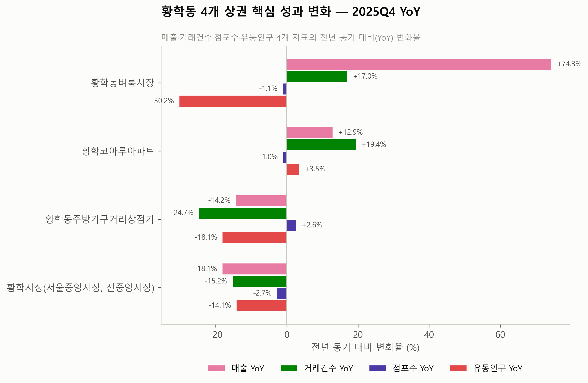
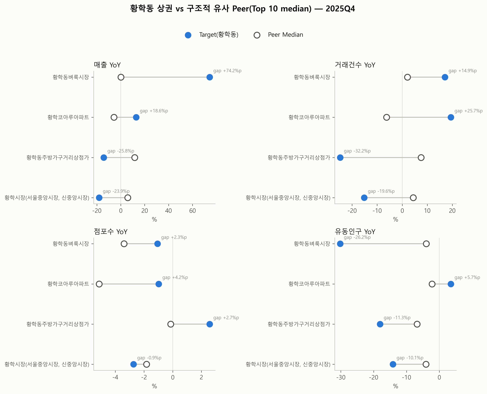
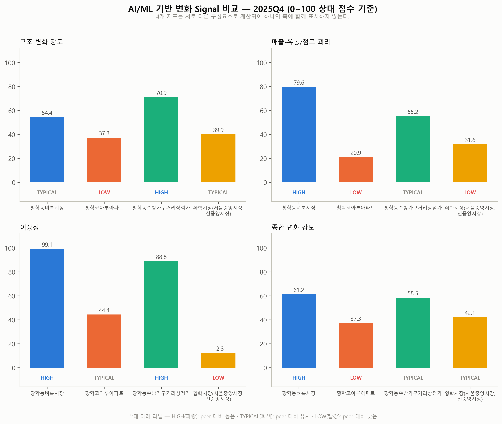
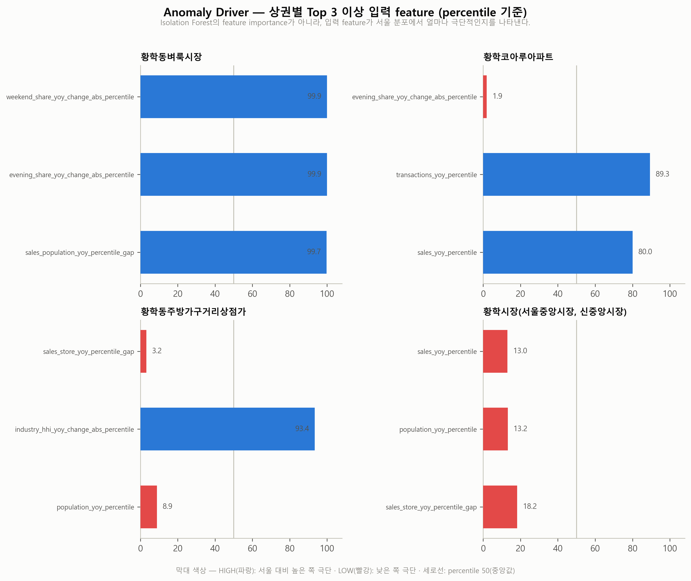
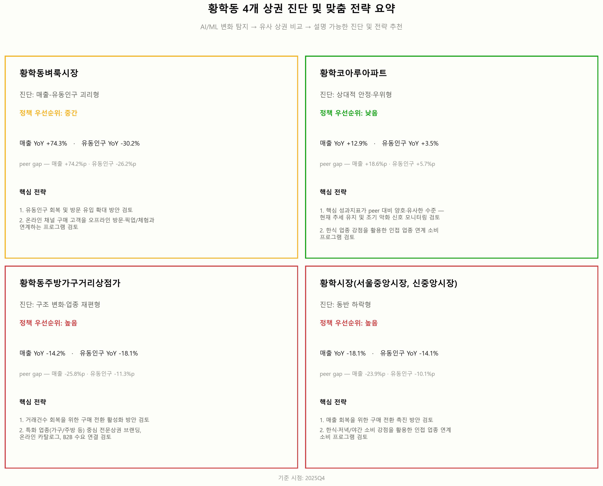

# Hwanghak Commercial Analysis

공공데이터와 AI/ML을 활용하여 서울 황학동 일대 4개 상권의 변화 패턴을 탐지하고,
구조적으로 유사한 Peer 상권과 비교하여 상권별 문제·강점·위험에 기반한 맞춤 전략을 제안하는 프로젝트입니다.

```text
Public Data · Commercial Area Analysis · Isolation Forest ·
Nearest Neighbor · Peer Benchmark · Explainable Strategy Recommendation
```

---

## Key Findings (2025Q4 기준)

- 같은 황학동 안에서도 4개 상권은 서로 다른 변화 유형으로 진단됩니다 — 하나의 "황학동 상권"으로 뭉뚱그릴 수 없습니다.
- **황학동벼룩시장**: 매출 YoY +74.3%로 급증했지만 유동인구는 -30.2%로 급감 — 매출과 유동인구의 괴리가 Peer 대비로도 크게 나타났으며, Isolation Forest 기준 anomaly_percentile은 99.1로 서울 상권 중 매우 이례적인 변화에 해당.
- **황학동주방가구거리상점가**: 거래건수 -24.7%·매출 -14.2%로 부진한 동시에 구조 변화 강도(structural_change_score)가 70.9로 Peer Median 49.2보다 높게 나타난 상권.
- **황학시장(서울중앙시장, 신중앙시장)**: 매출·거래건수·점포수·유동인구 4개 지표가 모두 실제로 감소하는 전반적 동반 하락형.
- **황학코아루아파트**: 매출·거래·점포·유동인구 4개 핵심 지표가 모두 Peer 대비 양호해 4개 상권 중 유일하게 정책 우선순위 "낮음".
- 따라서 황학동 전체에 동일한 활성화 정책을 적용하기보다, 상권별 진단 근거(Peer Gap, AI/ML Signal)에 기반한 차별화 전략이 필요하다는 것이 이 프로젝트의 핵심 결론입니다.

---

## 1. 프로젝트 소개

이 프로젝트는 서울 황학동 일대 상권(황학동벼룩시장, 황학코아루아파트, 황학동주방가구거리상점가, 황학시장)을 대상으로,
서울시 상권분석서비스 공공데이터를 이용해 단순한 매출 증감 확인을 넘어

> 상권별 변화 패턴과 이상성(anomaly)을 탐지하고, 구조적으로 유사한 상권(Peer)과 비교한 뒤,
> 각 상권의 문제(Problem)·강점(Opportunity)·위험(Risk)을 구분하여 데이터 근거(Evidence) 기반의 맞춤 전략을 제안

하는 것을 목표로 합니다. 분석 전체는 `notebooks/01`~`08` 8단계 파이프라인으로 구성되어 있으며,
각 단계의 산출물은 `data/processed/`에 CSV로 저장되어 다음 단계에서 재사용됩니다.

## 2. 문제 정의

같은 지역에 위치한 상권이라도 성장 또는 쇠퇴의 원인은 서로 다를 수 있습니다. 실제로 `03_eda.ipynb`에서 확인한 바에 따르면,
2021~2025년 사이 황학동 4개 상권 중 2021년 기준 매출 비중이 가장 컸던 황학동주방가구거리상점가(전체의 46.6%)만 매출이 감소(-15.1%)했는데,
같은 기간 이 상권의 유동인구(+19.8%)와 점포수(+7.5%)는 오히려 증가했습니다. 즉 유동인구·점포가 늘어도 매출은 줄어드는
**괴리(decoupling)** 현상이 나타난 것으로, "매출이 늘었는지 줄었는지"만 보아서는 설명되지 않습니다.

따라서 이 프로젝트는 매출뿐 아니라 거래건수·점포·유동인구·업종구조·소비 시간대 등을 함께 보고, 서울 전체 상권 분포에서의
상대적 위치(percentile)와, 같은 상권 유형 내 구조적으로 유사한 Peer 대비 위치를 함께 확인하여 각 상권이 얼마나,
어떤 방식으로 특이하게 변하고 있는지를 진단합니다.

## 3. 분석 대상 및 데이터

### 분석 대상 (2025Q4 기준)

| 상권_코드 | 상권명 | 상권 구분 |
|---|---|---|
| 3110055 | 황학동벼룩시장 | 골목상권 |
| 3110057 | 황학코아루아파트 | 골목상권 |
| 3130054 | 황학동주방가구거리상점가 | 전통시장 |
| 3130055 | 황학시장(서울중앙시장, 신중앙시장) | 전통시장 |

`01_data_understanding.ipynb`에서 서울시 전체 상권 데이터 중 상권명에 "황학"이 포함된 4개 코드를 1차 스크리닝으로 확인했으며,
GIS 경계 데이터로 행정동 기준 일치 여부까지는 검증하지 않았습니다.

### 원본 데이터

서울시 상권분석서비스에서 제공하는 4종의 원본 데이터(2021Q1~2025Q4, 20개 분기)를 사용했습니다. 정확한 다운로드 URL은
노트북/코드 어디에도 기록되어 있지 않아 임의로 표기하지 않았습니다.

| 데이터 | 원본 데이터명 | 주요 정보 | 분석 활용 |
|---|---|---|---|
| sales | 서울시 상권분석서비스 추정매출-상권 | 업종별 매출금액/건수, 요일·시간대·연령·성별 매출 | 상권 성과(매출·거래) 및 소비 시간/연령 구조 분석 |
| stores | 서울시 상권분석서비스 점포-상권 | 점포수, 개업/폐업 점포수, 프랜차이즈 점포수 | 점포 역동성(개폐업) 분석 |
| population | 서울시 상권분석서비스 길단위인구-상권 | 유동인구, 연령·성별·요일·시간대별 유동인구 | 활동성(유동인구) 분석 |
| commercial_area | 서울시 상권분석서비스 영역-상권 GIS | 상권 경계 shapefile | `01`에서 좌표계 확인 용도로만 참고, 이후 분석 파이프라인에는 사용되지 않음 |

`data/raw/`, `data/processed/`는 `.gitignore`에 포함되어 있어 GitHub 저장소에는 실제 데이터 파일이 올라가 있지 않습니다.
재현하려면 위 4종 데이터셋을 각각 `data/raw/sales/`, `data/raw/stores/`, `data/raw/population/`, `data/raw/commercial_area/`에
연도별(sales·stores) 또는 연도-분기별(population) CSV/shapefile로 배치해야 합니다.

## 4. 분석 파이프라인

| 단계 | Notebook | 역할 |
|---|---|---|
| 01 | `01_data_understanding.ipynb` | 원본 데이터 구조 파악, 황학동 4개 상권 코드 식별 |
| 02 | `02_preprocessing.ipynb` | 컬럼명 통일, 데이터 품질 이슈 확인(결측·중복·이상값), 연도별 파일 통합 |
| 03 | `03_eda.ipynb` | 황학동 4개 상권의 장기(2021~2025) 변화 패턴 탐색, 서울 전체와 비교 |
| 04 | `04_feature_engineering.ipynb` | 규모·점포역동성·시간대/연령/업종 구조·성장률·변동성·괴리 등 상권x분기 Feature 생성 |
| 05 | `05_commercial_signal.ipynb` | Isolation Forest 기반 AI/ML 변화 Signal 및 Anomaly Driver 산출, KMeans로 서울 상권 변화 유형 보조 탐색 |
| 06 | `06_peer_benchmark.ipynb` | Nearest Neighbor로 Peer 상권 탐색, Peer Median/Gap 계산 |
| 07 | `07_strategy_recommendation.ipynb` | Rule 기반 진단(diagnosis_type)과 Problem/Opportunity/Risk 전략(Evidence 포함) 산출 |
| 08 | `08_final_visualization.ipynb` | 최종 결과를 10개 Figure로 시각화 |

각 단계는 이전 단계가 `data/processed/`에 저장한 산출물을 그대로 불러와 사용하므로, `01→08` 순서로 실행해야 합니다.

## 5. AI/ML 활용 방법

이 프로젝트에서 AI/ML은 정책 문장을 직접 생성하지 않습니다. 역할은 다음과 같이 분리되어 있습니다.

```text
AI/ML은
① 이상 변화 탐지 (Isolation Forest)
② 유사 상권 탐색 (Nearest Neighbor)
를 담당한다.

최종 전략은
③ Peer 상대 비교 (Peer Benchmark)
④ 설명 가능한 Rule (Rule-based Diagnosis)
⑤ 실제 데이터 Evidence
를 통해 산출된다.
```

즉 "AI가 정책을 자동 생성한다"가 아니라, **AI가 사람이 놓치기 쉬운 변화와 비교 대상을 탐색하고, 설명 가능한 진단
엔진이 전략 후보를 제시**하는 구조입니다. `07` 노트북은 전체 흐름을 다음과 같은 파이프라인으로 명시합니다.

```text
Isolation Forest (05)         → 이상 변화 탐지
Anomaly Driver (05)           → 이상 변화의 맥락 설명(model attribution 아님)
Nearest Neighbor (06)         → 구조적 유사 상권(Peer) 탐색
Peer Benchmark (06)           → 상대적 성과 차이(Peer Gap) 진단
Rule-based Classification(07) → diagnosis_type / priority_level 판정
Rule-based Evidence Engine(07)→ Problem / Opportunity / Risk 추출
Domain-based Strategy Mapping(07)→ Strategy 1~3 + Evidence 연결
```

핵심 AI/ML(Isolation Forest, Nearest Neighbor)과 보조 탐색(KMeans)의 역할은 명확히 구분됩니다.

| 구분 | 모델 | 최종 진단·전략(07)에 직접 연결되는가 |
|---|---|---|
| 핵심 AI/ML | **Isolation Forest** | 예 — `anomaly_percentile`이 diagnosis_type/priority_level/Strategy 3의 근거로 사용됨 |
| 핵심 AI/ML | **Nearest Neighbor** | 예 — Peer Median/Gap이 진단·전략 전체의 기반이 됨 |
| 보조 탐색 | **KMeans** | 아니오 — 서울 상권 전체의 변화 유형을 탐색하는 참고용 typology만 생성 |

### Isolation Forest — 이상 변화 탐지

- 분기별로, 황학동 4개 상권을 제외한 서울 상권을 대상으로 `RobustScaler`를 적용한 뒤
  `IsolationForest(n_estimators=200, contamination=0.05, random_state=42)`를 학습합니다.
- 입력은 `AI_FEATURE_COLS` 11개(매출/거래/점포/유동인구 YoY percentile, 주말·저녁야간 비중 변화폭 percentile,
  업종 HHI 변화폭 percentile, 매출 변동성 percentile, 폐업강도 percentile, 매출-유동인구/점포 YoY percentile gap)입니다.
- `-score_samples()`를 `anomaly_score`로, 그 분기 서울 상권 내 percentile을 `anomaly_percentile`로 저장합니다.
  anomaly_percentile≥95이면 `attention_flag=True`이지만, 이는 "이상하다"는 신호일 뿐 "쇠퇴"를 의미하지 않습니다(급성장도 이상치로 잡힙니다).

### Anomaly Driver — 이상 변화의 맥락 설명 (Top Abnormal Input Features)

anomaly_percentile만으로는 상권의 전반적인 이상성 수준은 알 수 있지만, 어떤 입력 Feature가 서울 분포의 극단에 위치하는지는 알기 어렵습니다. 이를 보완하기
위해 `05`는 `AI_FEATURE_COLS` 11개 중 이미 서울 분포 percentile로 만들어진 9개는 그 값을 그대로 사용하고,
percentile 간 차이(gap)로 정의된 나머지 2개(`sales_population_yoy_percentile_gap`, `sales_store_yoy_percentile_gap`)만
같은 분기 서울 reference 분포에서 percentile로 새로 변환합니다(이미 percentile인 값을 다시 percentile화하는
이중 변환은 발생하지 않습니다). 이렇게 얻은 11개의 percentile에 `extremeness = |percentile - 50|`을 적용해
Top 3 feature를 뽑아 `hwanghak_anomaly_drivers.csv`에 저장하고, `07`을 거쳐 `hwanghak_strategy_recommendation.csv`의
`anomaly_driver_1~3`(+`_percentile`, `_direction`) 컬럼으로 그대로 전달합니다.

> **Anomaly Driver는 Isolation Forest의 feature importance/model attribution이 아닙니다.** Isolation Forest는
> "각 feature가 판정에 얼마나 기여했는가"를 직접 제공하지 않으며, 이 프로젝트는 SHAP 등으로 그런 기여도를 새로
> 만들어내지도 않습니다. Anomaly Driver는 "이 판정의 원인"이 아니라 **"입력값 자체가 서울 분포에서 얼마나
> 극단적인가(input abnormality)"**를 percentile로 요약한 보조 지표이며, 새로운 전략 Rule에 연결하지 않습니다(기존
> Problem/Opportunity/Risk 전략 결정 로직은 그대로 유지됩니다).

`direction`의 `HIGH`/`LOW`는 **"좋음/나쁨"이 아니라 해당 feature가 같은 분기 서울 상권 분포의 상단(HIGH) 또는
하단(LOW) 극단에 위치한다는 뜻**입니다. 특히 `weekend_share_yoy_change_abs_percentile`처럼 변화의 "크기(절댓값)"를
percentile화한 feature는 `HIGH`가 "변화 폭이 크다"는 의미일 뿐, 그 변화가 긍정적인지 부정적인지는 알려주지 않습니다.

2025Q4 기준 상권별 Top 1 Driver는 다음과 같습니다.

| 상권 | Top 1 Anomaly Driver | Percentile | Direction |
|---|---|---|---|
| 황학동벼룩시장 | weekend_share_yoy_change_abs_percentile | 99.9 | HIGH |
| 황학코아루아파트 | evening_share_yoy_change_abs_percentile | 1.9 | LOW |
| 황학동주방가구거리상점가 | sales_store_yoy_percentile_gap | 3.2 | LOW |
| 황학시장(서울중앙시장, 신중앙시장) | sales_yoy_percentile | 13.0 | LOW |

(전체 Top 3 목록은 `data/processed/hwanghak_anomaly_drivers.csv` 및 [Figure 10](reports/figures/10_anomaly_driver.png) 참고)

### Nearest Neighbor — Peer 상권 탐색

Peer 상권을 찾는 방법은 [6. Peer Benchmark](#6-peer-benchmark)에서 자세히 설명합니다.

### KMeans — 서울 상권 변화 유형 탐색 (보조 탐색)

`05`는 direction_score·structural_change_score·decoupling_score·instability_score 4개 signal을 기준으로
실루엣/Calinski-Harabasz 점수로 군집 수를 자동 선택한 뒤 KMeans로 서울 상권 전체의 변화 유형을 탐색적으로 분류하고,
`cluster`/`cluster_label`을 `data/processed/latest_commercial_typology.csv`(서울 1,650개 상권, 2025Q4 기준)에 저장합니다.
**이 클러스터 결과는 서울 상권 전체의 변화 유형을 탐색적으로 파악하기 위한 보조 분석이며, 황학동 4개 상권의 최종
진단·정책 추천(`07`)에는 직접 사용하지 않습니다.**

### AI/ML Signal (05 산출)

| Signal | 의미 |
|---|---|
| `direction_score` | 서울 상권 대비 상대적 방향성(−1~+1). 성장/감소의 확정 판정이 아니라 상대적 위치 |
| `structural_change_score` | 주말/저녁야간 비중, 업종 HHI, top1 업종 비중, 활성 업종 수 변화의 크기(0~100) |
| `decoupling_score` | 매출 변화와 유동인구/점포 변화가 서울 다른 상권보다 얼마나 크게 엇갈리는지(0~100) |
| `instability_score` | 최근 4분기 매출 변동성 + 개폐업 강도(0~100) |
| `change_intensity_score` | 위 세 신호(구조변화·괴리·불안정성)의 종합 변화 강도(0~100) |
| `anomaly_score` / `anomaly_percentile` | Isolation Forest 기반 이상성 점수와 그 percentile |

### 이 프로젝트가 하지 않는 것

`07` 노트북은 이 단계에서 새로운 anomaly/clustering/예측 모델, 딥러닝, DTW, PCA, SHAP, 외부 LLM API 호출,
임의의 가중합 점수를 만들지 않는다고 명시합니다. AI/ML은 05·06에서 이미 계산된 signal과 peer 관계를 그대로 가져다
Rule과 Evidence에 연결하는 데에만 사용됩니다.

## 6. Peer Benchmark

Peer Benchmark는 이 프로젝트의 핵심 차별점입니다. **단순히 서울 전체 평균과 비교한 것이 아니라, 같은 상권 유형(골목상권/전통시장) 안에서
구조적으로 가장 비슷한 상권을 찾아 상대적으로 비교**합니다.

- **Peer 선정 기준(`PEER_FEATURE_COLS`, 8개)**: log 변환한 매출·유동인구·점포수 4분기 평균, 주말 매출 비중 4분기 평균,
  저녁·야간 매출 비중 4분기 평균, 업종 HHI 4분기 평균, 1위 업종 매출 비중 4분기 평균, 활성 업종 수 4분기 평균.
  모두 **규모·구조 특성**이며, `05`에서 계산한 direction_score·anomaly_percentile 등 변화/이상성 signal은 코드에서
  `assert`로 명시적으로 제외되어 있습니다(peer 선정 로직과 진단 로직을 분리).
- **Baseline 시점**: 분석 대상 분기(2025Q4) 자체가 아니라 **직전 4개 분기(2024Q4~2025Q3) 평균**을 사용합니다.
  06 노트북은 이를 "분석 대상 분기의 급격한 변화가 peer selection 자체에 영향을 주는 것을 방지하기 위함"이라고 명시합니다.
- **탐색 방법**: 같은 상권 유형 reference pool(골목상권 complete-case 1,022개, 전통시장 276개) 내에서
  `RobustScaler` + `NearestNeighbors(metric="euclidean")`로 Top20 후보를 찾고, Top10의 중앙값(Peer Median)/IQR로
  `peer_gap`·`peer_flag`(HIGH/TYPICAL/LOW)를 계산하며, Top3 상권명을 대표 Peer로 표시합니다.
- **Peer Gap = Target − Peer Median**: 양수라고 해서 실제 YoY가 증가했다는 뜻은 아닙니다. Peer보다 덜 감소한 경우에도
  Gap은 양수가 될 수 있습니다.
- **Robustness Check**: `hwanghak_peer_robustness.csv`에서 Top5/Top10/Top20 각각으로 계산한 Peer Median·Gap의 방향이
  일치하는지 사전에 점검해, Top10을 기준값으로 채택한 근거를 남겨두었습니다.
- **Peer 비교 가능성**: `nearest_peer_distance_percentile`은 같은 유형 내 다른 상권들의 leave-one-out 최근접 거리 분포에서
  해당 상권의 Top1 peer distance가 차지하는 위치입니다. 이 값이 낮을수록(=가까운 peer가 흔함) peer 비교를 더 신뢰할 수 있고,
  높을수록(=비슷한 비교 대상이 상대적으로 드묾) peer_gap 해석에 유의해야 한다는 보조 정보(`peer_comparability_level`)로 사용됩니다.

## 7. 핵심 분석 결과

2025Q4 기준, 4개 상권은 서로 다른 이유로 서로 다르게 진단되었습니다.

| 상권 | 유형 | 매출 YoY (Peer Gap) | 유동인구 YoY (Peer Gap) | 진단(diagnosis_type) | 정책 우선순위 |
|---|---|---|---|---|---|
| 황학동벼룩시장 | 골목상권 | +74.3% (+74.2%p) | −30.2% (−26.2%p) | 매출-유동인구 괴리형 | 중간 |
| 황학코아루아파트 | 골목상권 | +12.9% (+18.6%p) | +3.5% (+5.7%p) | 상대적 안정·우위형 | 낮음 |
| 황학동주방가구거리상점가 | 전통시장 | −14.2% (−25.8%p) | −18.1% (−11.3%p) | 구조 변화·업종 재편형 | 높음 |
| 황학시장(서울중앙시장, 신중앙시장) | 전통시장 | −18.1% (−23.9%p) | −14.1% (−10.1%p) | 동반 하락형 | 높음 |

(수치 출처: `data/processed/hwanghak_strategy_recommendation.csv`, `hwanghak_peer_benchmark.csv`)

- **황학동벼룩시장**은 매출이 Peer 대비 뚜렷하게 높지만(+74.2%p), 유동인구는 오히려 Peer보다 낮습니다(−26.2%p).
  이커머스 매출 비중이 79.8%로 매우 높아, 온라인 중심 거래가 오프라인 방문과 분리되어 있는 구조로 해석됩니다.
  anomaly_percentile 99.1로 서울 상권 중 가장 이례적인 변화를 보였습니다.
- **황학동주방가구거리상점가**는 거래건수(−32.2%p)·매출(−25.8%p)이 모두 Peer 대비 낮은 동시에,
  structural_change_score가 70.9(Peer Median 49.2)로 업종 재편이 뚜렷합니다. 가구/주방 업종 매출 비중이 56.9%로
  여전히 압도적이지만, 이 상권 자체의 매출은 2021~2025년 사이 −15.1% 감소했고 같은 기간 황학동 4개 상권 전체에서
  가구 업종 매출도 −26.9% 줄어(`03_eda.ipynb`), 상권 매출과 핵심 업종 매출이 함께 장기 하락하는 추세와 함께 봐야
  하는 상권입니다. Anomaly Driver 기준으로는 `sales_store_yoy_percentile_gap`(=`sales_yoy_percentile`−`stores_yoy_percentile`)이
  3.2 percentile(LOW)로 가장 극단적으로 나타나는데, 이는 점포수 YoY percentile(89.5, 서울 대비 상위권)에 비해
  매출 YoY percentile(16.2, 서울 대비 하위권)이 크게 낮아 그 격차가 서울 상권 중 가장 큰 축에 속한다는 뜻입니다.
- **황학시장(서울중앙시장, 신중앙시장)**은 매출(−23.9%p)과 거래건수(−19.6%p)가 함께 낮아 특정 신호 없이
  전반적으로 동반 하락하는 패턴을 보이며, structural_change_score·anomaly_percentile 모두 Peer 대비 특별히 높지 않습니다.
- **황학코아루아파트**는 매출·거래·점포·유동인구 4개 성과지표가 모두 Peer 대비 양호하거나 유사한 수준으로,
  4개 상권 중 유일하게 우선순위 "낮음"으로 분류되었습니다. 다만 top1_industry_share가 Peer 대비 +15.2%p 높아
  단일 업종(한식) 의존도는 관리 포인트로 남아 있습니다.

같은 황학동 안에서도 "매출-유동인구 괴리", "구조적 업종 재편", "전반적 동반 하락", "상대적 안정"이라는 네 가지 서로 다른
패턴이 확인되며, 이는 하나의 정책을 4개 상권에 동일하게 적용하기 어렵다는 근거가 됩니다.

## 8. Evidence-based Strategy Recommendation

`07` 노트북은 상권별로 서로 다른 역할을 하는 전략 3개를 각각 실제 데이터 근거(Evidence)와 함께 산출합니다.

| 컬럼 | 역할 | 선택 기준 |
|---|---|---|
| `strategy_1` / `strategy_1_evidence` | Problem 대응 | 성과지표(매출/거래/점포/유동인구 YoY) 중 Peer 대비 LOW이면서 `\|peer_gap\|`이 가장 큰 지표 |
| `strategy_2` / `strategy_2_evidence` | Opportunity 활용 | 업종/시간대 등 도메인 지표 중 peer_gap이 임계값(0.05)을 초과하는 상대적 강점 |
| `strategy_3` / `strategy_3_evidence` | Risk 관리 | AI/ML Signal 중 Peer 대비 HIGH인 지표(진단 유형별 우선순위 적용), 없으면 업종 집중도(top1_industry_share) |

각 Evidence는 이미 계산된 `hwanghak_peer_benchmark.csv`의 Target/Peer Median/Gap 값을 그대로 문장으로 표시합니다. 예를 들어
황학동벼룩시장의 `strategy_1_evidence`는 다음과 같습니다.

> 유동인구 YoY이 Peer Median 대비 낮음 (Target -30.2%, Peer Median -4.0%, Gap -26.2%p)

근거가 없는 역할(예: 뚜렷한 강점이나 위험이 확인되지 않는 경우)은 강점/위험을 억지로 만들지 않고
"모니터링/추가 검토"와 같은 중립적 문구로 대체됩니다(예: 황학시장의 Risk는 "구조적 위험 신호가 뚜렷하게 확인되지 않음").
또한 07 노트북은 상권명을 조건으로 사용하지 않는 "상권명 하드코딩 금지 원칙"을 명시해, 전략이 특정 상권 이름이 아니라
peer_flag/peer_gap 값으로만 결정되도록 설계했습니다. 이 구조가 프로젝트의 설명 가능성(Explainability)을 뒷받침합니다.

참고로 결과 CSV에는 이전 버전과의 호환을 위한 `strategy_basis_1~3` 별칭 컬럼이 `strategy_1~3_evidence`와 동일한 값으로
함께 저장되어 있으며, 현재 기준 컬럼은 `strategy_1~3_evidence`입니다.

CSV에는 [Anomaly Driver](#5-aiml-활용-방법)에서 설명한 `anomaly_driver_1~3` 컬럼도 함께 저장되어 있지만, 이는
Strategy 1~3의 선택 근거로 사용되지 않습니다. Anomaly Driver는 "이상 변화의 맥락을 설명"하는 별도의 보조 지표이고,
Strategy 3(Risk)의 근거는 여전히 `AI_SIGNAL_METRICS`의 `peer_flag`(HIGH/TYPICAL/LOW)만으로 결정됩니다 — 두 지표를
섞지 않고 역할을 분리해 유지합니다.

## 9. 주요 시각화

`reports/figures/`에 저장된 10개 Figure 중, 프로젝트의 핵심 흐름(절대 변화 → Peer 비교 → AI/ML Signal → Anomaly
Driver → 종합 전략)을 가장 잘 보여주는 5개를 선별했습니다.



매출·거래건수·점포수·유동인구 4개 지표의 2025Q4 YoY 변화율입니다. 황학동벼룩시장의 매출(+74.3%)과 유동인구(−30.2%)처럼
같은 상권 안에서도 지표별 방향이 크게 엇갈릴 수 있다는 것을 절대값 기준으로 먼저 보여줍니다.



구조적으로 유사한 Peer(Top10 median)와 나란히 비교함으로써, 절대 변화율만으로는 확인하기 어려운 상대적 강점과 약점을
드러냅니다. 예를 들어 황학코아루아파트의 매출 YoY(+12.9%)는 절대값으로는 평범해 보이지만 Peer Median 대비로는 +18.6%p
높은 수준입니다.



Isolation Forest 기반 anomaly_percentile을 포함한 4개 AI/ML Signal을 0~100 상대 점수로 비교합니다. 황학동벼룩시장과
황학동주방가구거리상점가는 anomaly_percentile이 각각 99.1, 88.8로 서울 상권 중에서도 이례적인 변화를 보이지만,
그 이례성의 성격(괴리 vs 구조 변화)은 서로 다르다는 것을 함께 확인할 수 있습니다.



anomaly_percentile이 "얼마나 이상한가"를 보여준다면, 이 Figure는 "어떤 입력 Feature가 서울 분포의 극단에 위치하는가"에 대한 맥락을 보완합니다.
막대 길이는 Isolation Forest의 feature importance가 아니라, 각 입력 feature가 서울 상권 분포에서 얼마나 극단적인
percentile에 위치하는지를 나타냅니다.



AI/ML 변화 탐지 → 유사 상권 비교 → 설명 가능한 진단 및 전략 추천이라는 전체 파이프라인의 최종 결과물로,
4개 상권이 서로 다른 진단·우선순위·핵심 전략을 갖는다는 점을 한 화면에 요약합니다.

## 10. 프로젝트 구조

```text
Hwanghak_Commercial_Analysis/
├── data/
│   ├── raw/                # 원본 데이터 (git 미포함, 직접 배치 필요)
│   │   ├── sales/
│   │   ├── stores/
│   │   ├── population/
│   │   └── commercial_area/
│   └── processed/          # 전처리·Feature·Signal·Peer·Strategy 산출물 (git 미포함)
├── notebooks/
│   ├── 01_data_understanding.ipynb
│   ├── 02_preprocessing.ipynb
│   ├── 03_eda.ipynb
│   ├── 04_feature_engineering.ipynb
│   ├── 05_commercial_signal.ipynb
│   ├── 06_peer_benchmark.ipynb
│   ├── 07_strategy_recommendation.ipynb
│   └── 08_final_visualization.ipynb
├── reports/
│   └── figures/             # 08에서 생성되는 최종 Figure (PNG 10종)
├── README.md
├── requirements.txt
└── .gitignore
```

## 11. 실행 방법

이 저장소는 별도의 `src/` 모듈 없이, 분석 전체가 8개의 Jupyter Notebook으로 구성되어 있습니다. 노트북 실행에
필요한 패키지는 `requirements.txt`에 정리되어 있으며(실제 실행 환경에서 확인한 버전 기준: pandas 2.3.3, numpy
2.3.5, scikit-learn 1.7.2, matplotlib 3.10.6, seaborn 0.13.2, jupyter 1.1.1), `01`에서 GIS shapefile을 확인할 때만
선택적으로 사용되는 `geopandas`는 기본 설치 목록에서 제외했습니다(미설치 시 해당 확인 단계만 건너뜁니다).

```bash
cd Hwanghak_Commercial_Analysis
pip install -r requirements.txt
```

원본 데이터를 [3. 분석 대상 및 데이터](#3-분석-대상-및-데이터)에서 설명한 경로(`data/raw/sales/`, `data/raw/stores/`,
`data/raw/population/`, `data/raw/commercial_area/`)에 배치한 뒤, 아래 순서대로 노트북을 실행합니다. 각 단계는 이전 단계의
`data/processed/` 산출물을 그대로 불러오므로 순서를 건너뛸 수 없습니다.

```text
01 → 02 → 03 → 04 → 05 → 06 → 07 → 08
```

- `01~02`는 서울시 전체 데이터를 정제해 `data/processed/{sales,stores,population}.csv`를 생성합니다.
- `04`는 상권x분기 Feature 테이블(`commercial_features.csv`)을, `05`는 여기에 AI/ML Signal을 더한
  `commercial_signals.csv`, 서울 상권 typology(`latest_commercial_typology.csv`), 황학동 4개 상권의 Anomaly
  Driver(`hwanghak_anomaly_drivers.csv`)를 생성합니다.
- `06`은 황학동 4개 상권의 Peer Benchmark 결과(`hwanghak_peer_benchmark.csv`, `hwanghak_peer_matches.csv`,
  `hwanghak_peer_robustness.csv`)를, `07`은 이를 05의 Anomaly Driver와 함께 병합한 최종 진단·전략 테이블
  (`hwanghak_strategy_recommendation.csv`, 4행×57열)을 생성합니다.
- `08`은 `reports/figures/`에 10개 PNG를 저장합니다.

## 12. 한계 및 향후 개선

### 한계

- **분석 대상 상권 수가 4개로 제한적**입니다. 이 4개는 상권명에 "황학"이 포함된 코드를 1차 스크리닝한 결과이며,
  GIS 경계 기준 행정동 일치 여부는 검증하지 않았습니다.
- 공공데이터의 시간 해상도가 **분기 단위**이고, 매출-유동인구 등 데이터 간 집계 기준/기간이 완전히 동일하다고 확인되지 않아
  일부 비교(예: 매출-유동인구 괴리)는 인과관계가 아닌 동시 관측 상의 상관관계로만 해석해야 합니다.
- Peer 선정 기준(8개 feature, Top10 median), Rule threshold(예: DOMAIN_GAP_THRESHOLD=0.05, anomaly_percentile≥95),
  priority_level 조건문 등에는 분석자가 정한 heuristic이 일부 포함되어 있습니다. Robustness check로 Top5/10/20 간
  방향 일치는 확인했지만, threshold 자체의 최적성이 검증된 것은 아닙니다.
- **Peer는 상권 내부의 규모·업종·소비 구조가 유사한 상권을 찾는 것이며, 공간적·사회경제적 맥락까지 동일하다는
  의미는 아닙니다.** `PEER_FEATURE_COLS`에는 임대료, 배후 거주인구, 소득 수준, 지하철/교통 접근성, 관광 수요,
  재개발 이슈, 토지 이용, 두 상권 간 실제 공간적 거리가 포함되지 않습니다. 따라서 구조적으로는 비슷하지만
  지역적 맥락은 전혀 다른 상권이 Peer로 선택될 가능성이 있으며, 이 프로젝트는 그 가능성을 별도로 검증하지
  않았습니다.
- 이 프로젝트가 제안하는 전략은 데이터 기반 **정책 후보**이며, 실제 정책 시행 전후의 효과를 실험적으로 검증한 것은
  아닙니다. 현장 조사와 상인 인터뷰 등 추가 검증이 필요합니다.

### 향후 개선 방향

- 더 많은 분기의 시계열이 축적되면 YoY/변동성 지표의 안정성을 높일 수 있습니다.
- 황학동 외 다른 서울 상권으로 동일 파이프라인을 확대 적용해 방법론을 일반화할 수 있습니다.
- 실제 정책이 시행된 이후, `outcome_kpi_1~3`(성과 지표)의 변화를 추적해 전략의 사후 효과를 검증할 수 있습니다.
- Peer 선정 feature 조합이나 거리 metric을 다양화해 peer 방법론 자체를 고도화할 수 있습니다.
- 위 Peer Benchmark 한계와 직접 연결되는 개선 방향으로, `data/raw/commercial_area/` GIS 상권 경계 데이터와
  임대료·배후 거주인구 등 공간·사회경제 데이터를 실제로 결합해 공간적 인접성과 지역 맥락을 Peer 선정이나
  시각화에 반영할 수 있습니다.
